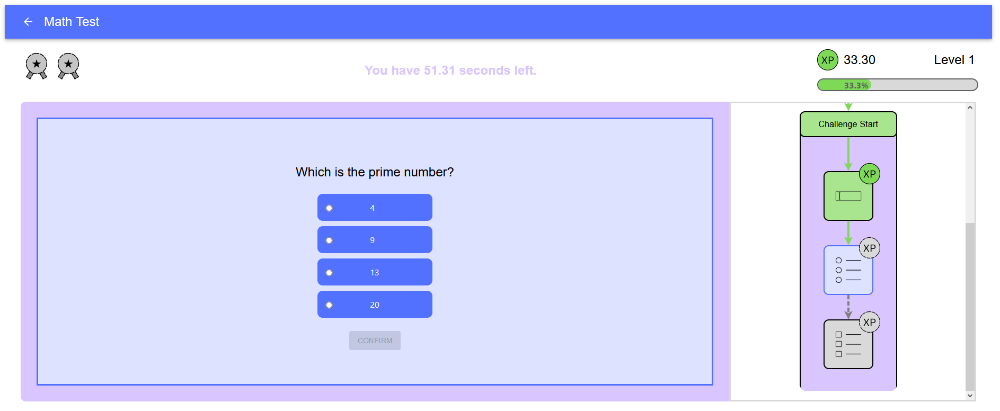

# Gamificated BPMN Engine

This repository contains a gamified implementation of a BPMN (Business Process Model and Notation) engine. It is built using React and TypeScript.

The project aims to provide a unique approach to visualizing and interacting with BPMN processes by introducing gamification elements. This is achieved by extending the traditional BPMN elements with game mechanics, such as challenges, rewards and a minimap. The goal is to make the process more engaging and enjoyable for the user.

You can try the engine at [http://gbpmnengine.mertendieckmann.de/](http://gbpmnengine.mertendieckmann.de/).

To create the gamificated bpmn processes for this engine, there is a separate editor available. You can access the editor at [http://gbpmneditor.mertendieckmann.de/](http://gbpmneditor.mertendieckmann.de/) or you can view the [editor github repository](https://github.com/MertenD/bpmn-editor).



## Overview

The main entry point of the application is `src/App.tsx`, which sets up the React application and includes the main components.

The application's core functionality is encapsulated in the `Engine` component (`src/components/Engine.tsx`). The engine manages the game engine's state and behavior, and it uses a `NodeMap` to keep track of the nodes in the BPMN process.

The `NodeMap` is a map where the keys are strings (IDs of flow elements) and the values are objects containing a `node` and `next` properties. The `node` is an instance of `BasicNode`, which represents a node in the BPMN process. The `next` is a record that maps `NextNodeKey` to `NodeMapKey`, which is used to determine the next node in the process based on the outcome of the current node.

When the engine runs, it starts at the `StartNode` and follows the `next` links in the `NodeMap` until it reaches an `EndNode`. Along the way, it executes the `run` method of each node, which can perform various actions such as presenting a challenge to the user, providing information, or applying a gamification event.

## Nodes

The application includes several types of nodes, each represented by a class which can be found in the `src/nodes/` directory:

- `ActivityNode`: Represents an activity node in the BPMN process. Activity nodes are the primary type of node and represent tasks that are performed in the process.

- `ChallengeNode`: Represents a challenge node in the BPMN process. Challenge nodes are a special type of activity node that include a gamification element.

- `EndNode`: Represents an end node in the BPMN process. End nodes signify the end of a process or a path within a process.

- `GatewayNode`: Represents a gateway node in the BPMN process. Gateway nodes are used to control the flow of the process, typically through decision making.

- `GamificationEventNode`: Represents a gamification event node in the BPMN process. Gamification event nodes are used to apply gamification elements to the process.

- `InfoNode`: Represents an info node in the BPMN process. Info nodes are used to provide information to the user.

- `StartNode`: Represents a start node in the BPMN process. Start nodes signify the start of a process.

## State Management

The state of the BPMN process is managed using the `flowStore` (`src/stores/flowStore.ts`). The flow store keeps track of the current state of the process and provides functions for moving to the next node.

## Utilities

The application includes utility functions for importing and parsing BPMN files (`src/util/Importer.ts` and `src/util/Parser.ts`). These utilities are used to load BPMN files into the application and parse them into a format that the application can use.

## Getting Started

To get started with this project, clone the repository and install the dependencies:

```bash
git clone https://github.com/MertenD/gamificated-bpmn-engine.git
cd gamificated-bpmn-engine
npm install
```

Then, you can start the application:

```bash
npm start
```

The application will be available at http://localhost:3000.

